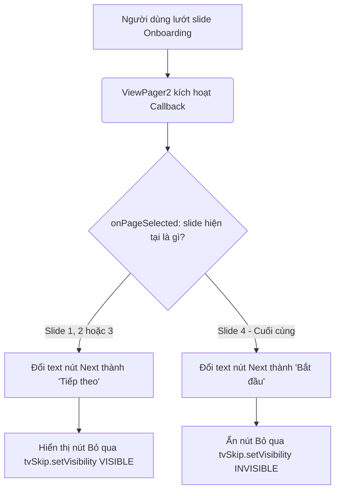

# Hướng dẫn & Tài liệu thay đổi Onboarding - VEGGO App

Tài liệu này mô tả chi tiết các thay đổi về giao diện (UI) và logic của màn hình giới thiệu ứng dụng (**Onboarding**). Các cải tiến này giúp giao diện nhất quán, căn chỉnh chuẩn xác trên nhiều dòng màn hình và cải thiện trải nghiệm người dùng.

---

## 1. Các thay đổi về Giao diện (UI Layout & Adapter Refactoring)

### 📌 Chuyển đổi sang ConstraintLayout trong `item_onboarding.xml`
* **Trước thay đổi:** Sử dụng `LinearLayout` (vertical) làm layout cha. Việc này gây ra tình trạng phân bổ khoảng cách không đồng đều hoặc bị đẩy lệch khi chạy trên các thiết bị có độ phân giải hoặc tỷ lệ màn hình khác nhau.
* **Sau thay đổi:** Chuyển đổi toàn bộ layout của item onboarding sang `ConstraintLayout` ([item_onboarding.xml](file:///d:/NAM3/Ky3/M_Commerce/VEGGO/app/src/main/res/layout/item_onboarding.xml)). 
  * Các thành phần như tiêu đề chào mừng (`tvChaomung`), Logo (`imageLogo`), Ảnh minh họa (`imageOnboarding`), Tiêu đề slide (`tvTitle`), và Mô tả (`tvDesc`) đều được định vị rõ ràng thông qua các ràng buộc (constraints) và margin chuẩn.
  * Kích thước chữ của `tvTitle` được tinh chỉnh từ `26sp` xuống `22sp` để hiển thị cân đối và gọn gàng hơn.

### 📌 Loại bỏ logic chỉnh độ cao thủ công trong `OnboardingPagerAdapter.java`
* **Trước thay đổi:** Adapter phải tính toán và set chiều cao ảnh minh họa (`imageOnboarding`) bằng code Java dựa vào chỉ số vị trí trang (ví dụ: đặt cao 340dp ở trang 2 và 300dp ở các trang khác). Việc này gây giật giật khi vuốt chuyển trang.
* **Sau thay đổi:** Do đã sử dụng `ConstraintLayout` với các ràng buộc vị trí linh hoạt, chiều cao của ảnh minh họa được quy định cố định một cách tự nhiên trong file XML (`300dp`). Toàn bộ mã nguồn căn chỉnh chiều cao thủ công trong `OnboardingPagerAdapter.java` đã được loại bỏ để mã nguồn sạch và hiệu năng mượt mà hơn.

### 📌 Điều chỉnh chiều cao nút tiếp tục trong `activity_onboarding.xml`
* Nút chuyển trang tiếp theo (`btnNext`) được điều chỉnh giảm chiều cao từ `60dp` xuống `50dp` giúp nút trông thanh thoát và đồng bộ hơn với hệ thống button của toàn bộ ứng dụng.

---

## 2. Các thay đổi về Logic (Ẩn nút Bỏ qua ở trang cuối)

### 📌 Vấn đề giải quyết
* Giao diện Onboarding gồm có 4 slide.
* Ở slide thứ 4 (slide cuối cùng), nút chính `btnNext` đổi text thành **Bắt đầu** (`onboarding_start`) để người dùng nhấp vào và chuyển trực tiếp tới trang chủ. Do đó, nút **Bỏ qua** (`tvSkip`) ở dưới cùng màn hình trở nên dư thừa.

### 📌 Giải pháp triển khai
Tự động ẩn nút "Bỏ qua" (`tvSkip`) bằng trạng thái `View.INVISIBLE` khi trượt đến slide cuối và hiện lại (`View.VISIBLE`) nếu người dùng trượt ngược về các slide trước đó.



* **Tại sao dùng `View.INVISIBLE` thay vì `View.GONE`?**
  * Nút `btnNext` có ràng buộc phía dưới với `tvSkip`. Nếu đặt `tvSkip` thành `GONE`, nó sẽ bị biến mất hoàn toàn khỏi cấu trúc layout, khiến `btnNext` bị nhảy tụt xuống sát đáy màn hình.
  * Sử dụng `INVISIBLE` giữ nguyên kích thước của `tvSkip` giúp giao diện không bị giật hay thay đổi khoảng cách khi chuyển đổi giữa các slide.

### 💻 Chi tiết mã nguồn thay đổi trong [OnboardingActivity.java](file:///d:/NAM3/Ky3/M_Commerce/VEGGO/app/src/main/java/com/veggo/app/presentation/onboarding/OnboardingActivity.java):

```java
viewPager.registerOnPageChangeCallback(new ViewPager2.OnPageChangeCallback() {
    @Override
    public void onPageSelected(int position) {
        super.onPageSelected(position);
        updateIndicators(position);
        
        // Ẩn chữ Skip ở slide cuối cùng vì đã có nút Bắt đầu
        if (position == adapter.getItemCount() - 1) {
            btnNext.setText(R.string.onboarding_start);
            tvSkip.setVisibility(View.INVISIBLE);
        } else {
            btnNext.setText(R.string.onboarding_next);
            tvSkip.setVisibility(View.VISIBLE);
        }
    }
});
```

---

## 3. Hướng dẫn Kiểm thử (Testing)
1. Tiến hành biên dịch lại để đảm bảo không lỗi cú pháp:
   ```powershell
   .\gradlew.bat compileDebugJavaWithJavac
   ```
2. Mở ứng dụng và kiểm tra:
   * **Slide 1, 2, 3:** Đảm bảo bố cục hiển thị đều đặn nhờ `ConstraintLayout`, các chữ không bị đè lên nhau, chữ **Bỏ qua** hiển thị rõ ràng.
   * **Slide 4:** Chữ **Bỏ qua** ẩn đi, nút chính đổi thành **Bắt đầu**, bố cục không bị giật lệch vị trí.
